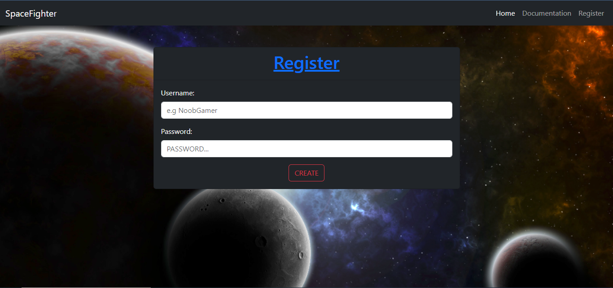

# Space Fighter


## API Documentation

### <ins>REGISTER POST REQUEST</ins>
Make a request to the endpoint https://spacefighter-5bdn2qsz.b4a.run/ :
```
{
    "username": "Ntobeko",
    "password": "malinga"
}
```
Response:
```
{
    "result": "created",
    "message": "User successfully created!"
}
```

###
### <ins>LOGIN POST REQUEST</ins>
Make a request to the endpoint https://spacefighter-5bdn2qsz.b4a.run/login
```
{
    "username": "Ntobeko",
    "password": "malinga"
}
```
Response:
```
{
    "result": "ok",
    "robots": {
        "types": [
            {
                "type": "NORMAL",
                "shots": 3,
                "shield": 3,
                "reload": 3,
                "bullet_travel_distance": 20,
                "damage": 1
            },
            {
                "type": "TANK",
                "shots": 3,
                "shield": 10,
                "reload": 3,
                "bullet_travel_distance": 20,
                "damage": 2
            },
            {
                "type": "SNIPER",
                "shots": 1,
                "shield": 3,
                "reload": 6,
                "bullet_travel_distance": 40,
                "damage": 4
            }
        ]
    },
    "message": "Login successful",
    "token": "yY9ARt-BQN3AqjiWYqaf_RbfE_Fniyq9eaLxVY7wbR8="
}
```

###
### <ins>LOGOUT POST REQUEST</ins>
Make a request to the endpoint https://spacefighter-5bdn2qsz.b4a.run/logout
```
{
    "token": "yY9ARt-BQN3AqjiWYqaf_RbfE_Fniyq9eaLxVY7wbR8="
}
```
Response:
```
{
    "result": "ok",
    "message": "Logout successful"
}
```

###
### <ins>GAME POST REQUEST</ins>
Make a request to the endpoint https://spacefighter-5bdn2qsz.b4a.run/game

<p>Game commands:</p>
<ul>
    <li>command: "fire", arguments: []</li>
    <li>command: "forward", arguments: ["10"]</li>
    <li>command: "launch", arguments: ["TANK"]</li>
    <li>command: "look", arguments: []</li>
    <li>command: "quit", arguments: []</li>
    <li>command: "reload", arguments: []</li>
    <li>command: "turn", arguments: ["left"]</li>
</ul>

```
{
    "command": "launch",
    "arguments": ["tank"],
    "token": "BfdqtVYlvUTqi1n_ImKWUUBvze8I4X_UaeGCFUhg3LM="
}
```
Response:
```
{
    "result": "ok",
    "data": {
        "result": "OK",
        "objects": [
            {
                "bottom_right_corner": [
                    10,
                    -10
                ],
                "position": [
                    0,
                    0
                ],
                "top_left_corner": [
                    -10,
                    10
                ],
                "type": "ASTEROID"
            },
            {
                "bottom_right_corner": [
                    0,
                    0
                ],
                "position": [
                    -1,
                    1
                ],
                "top_left_corner": [
                    -1,
                    1
                ],
                "type": "ASTEROID"
            },
            {
                "bottom_right_corner": [
                    2,
                    -1
                ],
                "position": [
                    1,
                    0
                ],
                "top_left_corner": [
                    1,
                    0
                ],
                "type": "ASTEROID"
            },
            {
                "topLeftCorner": [
                    -200,
                    200
                ],
                "bottomRightCorner": [
                    200,
                    -200
                ],
                "type": "WORLD"
            }
        ],
        "hit_object": [],
        "message": "Robot successfully launched",
        "status": {
            "shields": 10,
            "reload": 3,
            "bottom_right_corner": [
                90,
                -68
            ],
            "top_left_corner": [
                90,
                -68
            ],
            "position": [
                92,
                -70
            ],
            "max_shield": 10,
            "max_shots": 3,
            "shots": 3,
            "type": "ROBOT",
            "bullet_distance": 20,
            "status": "NORMAL",
            "direction": "SOUTH"
        }
    },
    "message": "Command executed"
}
```